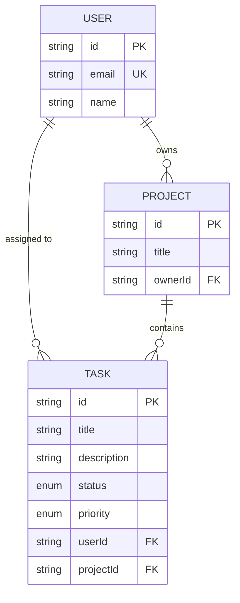
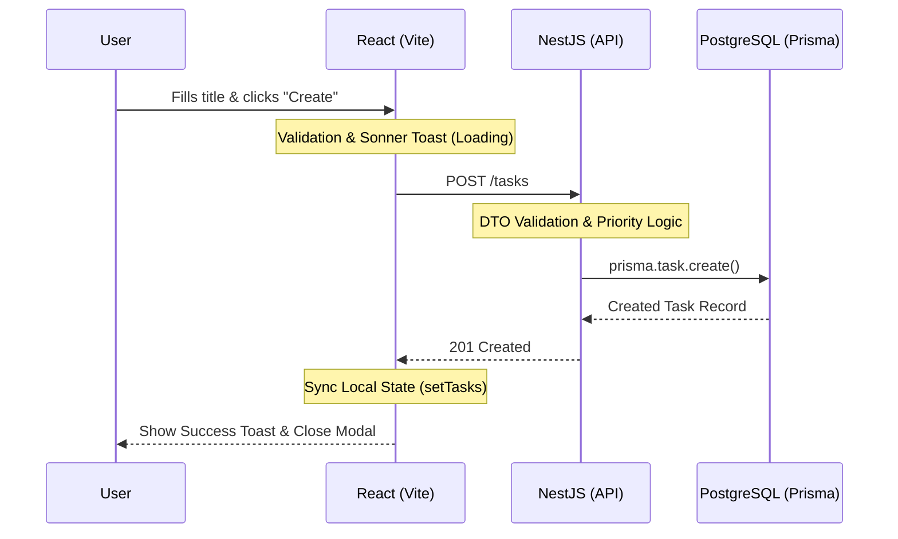

# 🚀 Learnovate: Vibe-Coding Experience

[](https://react.dev/)
[](https://nestjs.com/)
[](https://www.prisma.io/)
[](https://tailwindcss.com/)
[](https://www.docker.com/)

A professional, full-stack **Task Management Application** built as part of an autonomous AI development research study ("Vibe-Coding"). This project showcases a high-fidelity Kanban experience, a robust NestJS backend, and a containerized infrastructure, balancing modern aesthetics with industrial-grade engineering.

---

## 📊 System Architecture

### 🗄️ Database Schema (ERD)
Our data layer is built on PostgreSQL with Prisma ORM, ensuring strict type safety and relational integrity.



### 🔄 Core Application Flow (Task Creation)
This diagram illustrates the asynchronous lifecycle of a task creation event, from the React UI to the PostgreSQL database.



---

## ✨ Key Features

- **🎯 Interactive Kanban Board:** Drag-and-drop-ready UI with dynamic columns (To Do, In Progress, Done).
- **📝 Inline Editing:** Rename tasks instantly by clicking on their titles—persisted via PATCH requests.
- **➕ Functional Creation:** Add new tasks via a modern modal with real-time API synchronization.
- **🔔 Pro UX:** High-fidelity feedback with professional toast notifications (Sonner) and loading states.
- **🛤️ Professional Routing:** Integrated `react-router-dom` for scalable, browser-standard navigation.
- **🐳 Container First:** Fully dockerized setup compatible with both Docker and Podman.

---

## 🛠️ Tech Stack

### Frontend
- **Framework:** React 19 (TypeScript)
- **Build Tool:** Vite
- **Styling:** Tailwind CSS v4 (Modern Slate/Indigo palette)
- **Icons:** Lucide React
- **Notifications:** Sonner
- **Routing:** React Router 7

### Backend
- **Framework:** NestJS 11
- **ORM:** Prisma v6
- **Language:** TypeScript
- **Database:** PostgreSQL 15

### Infrastructure
- **Orchestration:** Docker Compose / Podman Compose
- **Container Runtime:** Node 20-Alpine

---

## 🚀 Getting Started

### 📋 Prerequisites
- **Node.js:** v20 or higher
- **NPM:** v10 or higher
- **Docker / Podman:** Installed and running

### 🔧 Installation & Setup

1. **Clone the Repository:**
   ```bash
   git clone https://github.com/shermidagreLearnovate/Learnovate-Vibe-Coding-Experience.git
   cd Learnovate-Vibe-Coding-Experience/project
   ```

2. **Install Dependencies:**
   ```bash
   npm install
   ```

3. **Infrastructure Setup:**
   ```bash
   # Using Docker
   docker-compose up -d
   ```

4. **Initialize Database:**
   ```bash
   cd backend
   npx prisma db push
   ```

5. **Run in Development Mode:**
   ```bash
   # From the root 'project' directory
   npm run backend:dev
   npm run frontend:dev
   ```

---

## 📂 Project Structure

```text
Learnovate-Vibe-Coding-Experience/
├── project/                # The main application
│   ├── frontend/           # React + Vite + Tailwind
│   ├── backend/            # NestJS + Prisma
│   └── docker-compose.yml  # Infrastructure orchestration
├── phases/                 # Research documentation by phase
└── .github/gemini/         # AI Instruction and workflow center
```

---

## 📈 Project Progress

| Phase | Goal | Status |
|---|---|---|
| **Phase 1** | Infrastructure & Monorepo Setup | ✅ Completed |
| **Phase 2** | High-Fidelity Frontend UI | ✅ Completed |
| **Phase 3** | Backend API & Data Persistence | ✅ Completed |
| **Phase 4** | Refactoring & Advanced UX | ✅ Completed |
| **Phase 5** | Comprehensive Documentation | ✅ Completed |

---

## 📓 Developer Reflections

For a deep dive into the development process, technical failures, and autonomous AI insights, see:
- **[PROJECT_REVIEW.md](./PROJECT_REVIEW.md):** A detailed technical audit and 60-commit lifecycle analysis.
- **[SINCERE_NARRATIVE.md](./SINCERE_NARRATIVE.md):** A sincere reflection on the "Aesthetic Trap" and the partnership between AI and Human engineering.

---

## 📝 License
This project is part of a private research study. See the `README.md` in the root for specific study goals and rules.
