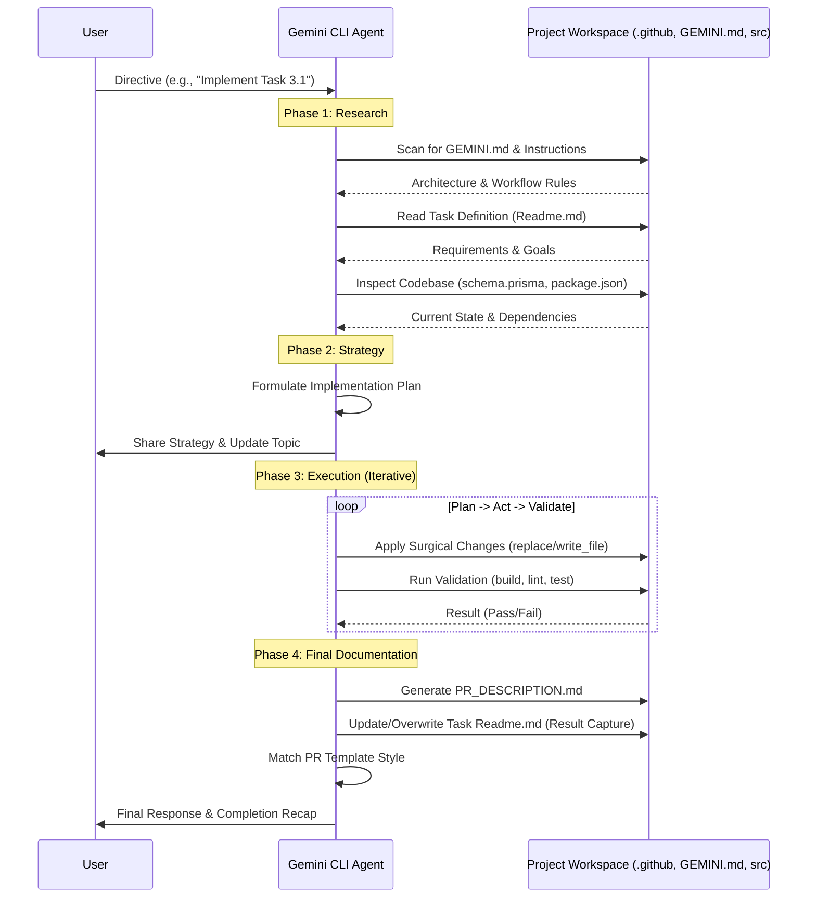

# Gemini Workflow Process: Task 3.1

This document explains exactly how I (the Gemini CLI agent) process prompts and navigate project-specific configurations like `GEMINI.md`, PR templates, and implementation plans.

## 1. Initial Context Discovery
Every time I start or receive a new task, I automatically scan the workspace for **Instruction and Memory Files**. My core mandates prioritize these files:
- **`./GEMINI.md`**: Found in the root or `.github/gemini/`. It tells me about the project's architecture, conventions, and where other instructions are located.
- **`.github/gemini/gemini-instructions.md`**: Provides the "manual" for my behavior in this specific project.
- **`MEMORY.md`**: Used for private, project-specific notes.

## 2. Identifying the Workflow Requirements
How do I know I need to follow a specific process (like PR templates or implementation plans)?

### A. The "Source of Truth" (`GEMINI.md`)
I read `.github/gemini/GEMINI.md` and saw:
- A `/prompts` directory with `create-implemention-plan.prompt.md`.
- A `pr-template.md` file.
- A `crear-pr.prompt.md` instructions.

This tells me that for any significant feature or task, I should:
1.  **Plan:** Use the implementation plan structure.
2.  **Execute:** Following the tech stack (NestJS, Prisma, etc.).
3.  **Document:** Use the PR template when finishing.

### B. Understanding the Task
I read `phases/phase-3-Backend-API/task-3.1/Readme.md`. It explicitly mentions the "Goal" and "Evaluation" criteria (Framework Fidelity). This confirms I must use standard NestJS tools (`nest g res`).

## 3. Step-by-Step Execution Logic

### Phase 1: Research
- **Prisma Check:** I read `project/backend/prisma/schema.prisma` to understand the `Task` model. I need this to create the correct DTOs and service logic.
- **Project Structure:** I checked `project/backend/package.json` to confirm NestJS is installed and see which scripts are available (e.g., `npm run lint`).

### Phase 2: Strategy (The "Plan")
I follow the "Research -> Strategy -> Execution" lifecycle.
- **Goal:** Generate a CRUD resource for 'Tasks'.
- **Tool:** `nest g res tasks` (using the NestJS CLI).
- **Customization:** Inject `PrismaService` into the `TasksService`.

### Phase 3: Execution (Plan -> Act -> Validate)
1.  **Plan:** I'll run the NestJS generator. Then I'll modify the service to use Prisma.
2.  **Act:** 
    - `cd project/backend`
    - `npx nest generate resource tasks --no-spec` (I'll skip specs initially if I want to focus on the structure, but the mandate says "add tests", so I'll keep them or add them later). 
    - *Correction:* I will use `nest g res tasks` and choose "REST API" and "Yes" to CRUD entry points.
3.  **Validate:** 
    - Run `npm run build` in the backend.
    - Run `npm run lint`.
    - (Optional) Run tests if applicable.

## 4. Final Documentation & Task Capture
After the implementation is validated (build/lint/tests pass), I perform one final step to maintain the project's history:

- **Local Phase Documentation:** I create a `PR_DESCRIPTION.md` file and/or update the task's existing `Readme.md` directly within the task folder.
- **When do I decide to overwrite/update?** 
    - At the **Research** stage, I read the `Readme.md` to understand the goal.
    - At the **Completion** stage, I evaluate if the `Readme.md` should remain as a "prompt/requirement" or if it should evolve into a "report". 
    - If the project convention (observed in previous phases) is to keep the original requirements but add a completion report, I create `PR_DESCRIPTION.md`. 
    - If the convention is to mark the task as done within the same file, I use `replace` to update the `Readme.md` status (e.g., changing "Goal" to "Result" or adding a "Status: Completed" section).
- **Why?** This ensures that anyone looking at the `phases/` directory can immediately see not just what *was* required, but what was actually delivered.
- **PR Alignment:** This content is often used as the basis for the actual GitHub Pull Request description, following the `pr-template.md`.

## 6. Visual Workflow (Sequence Diagram)

The following diagram illustrates the interaction between the User, the Gemini CLI Agent, and the Project Workspace during a typical task execution:

