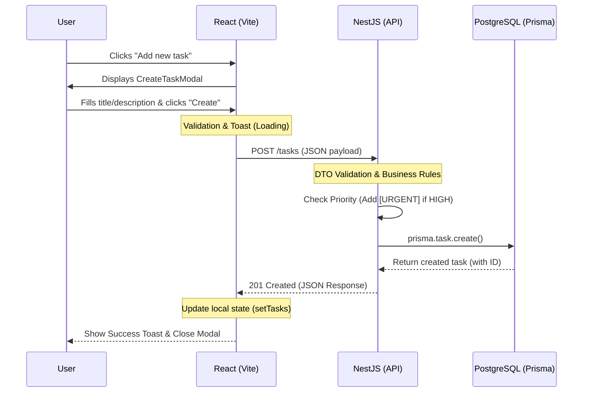
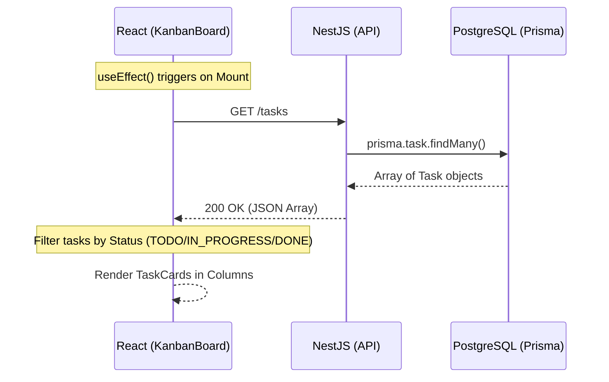

# 🔄 Application Flow Diagrams

This document illustrates the core interactions within the **Learnovate Task Management System**. We use **Mermaid** sequence diagrams to show the data flow between the User, Frontend, Backend, and Database layers.

---

## 1. Task Creation Flow
This diagram shows the process of adding a new task through the UI modal.

---

## 2. Inline Task Renaming Flow
This diagram shows the "Surgical Refactor" feature where a user renames a task directly on the card.

```mermaid
sequenceDiagram
    participant User
    participant Frontend as React (TaskCard)
    participant Backend as NestJS (API)
    participant DB as PostgreSQL (Prisma)

    User->>Frontend: Clicks on task title
    Frontend->>User: Switches text to <input>
    
    User->>Frontend: Edits title & presses "Enter" (or Blur)
    
    Note over Frontend: Toast (Loading: Updating task...)
    
    Frontend->>Backend: PATCH /tasks/:id ({ title: "New Title" })
    
    Backend->>DB: prisma.task.update()
    DB-->>Backend: Return updated record
    
    Backend-->>Frontend: 200 OK
    
    Note over Frontend: Sync local state
    Frontend-->>User: Show Success Toast & Switch to <h4>
```

---

## 3. Initial Data Loading (Dashboard)
How the Kanban board populates its data on load.

---

## 💡 Key Architectural Patterns
- **Optimistic/Async Updates:** The UI uses `sonner` to provide immediate feedback while the network request is in flight.
- **Stateless Backend:** The API relies on Prisma for efficient querying and doesn't hold session state between requests.
- **Prop Drilling vs State Management:** For this prototype, handlers are passed as props (`onUpdate`) to maintain simplicity.
