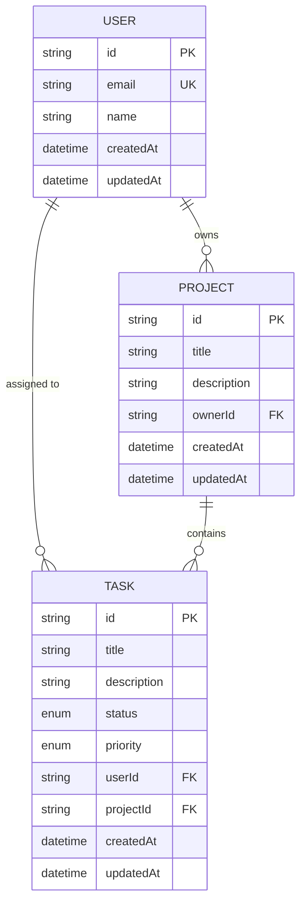

# 🗄️ Database Schema Documentation

This project uses **PostgreSQL** with **Prisma ORM**. The schema is designed to support a multi-user, multi-project task management system.

## 📊 Entity Relationship Diagram (ERD)



---

## 📑 Tables Definition

### 1. `User`
Stores user account information.
- **`id`** (String, PK): Unique identifier (UUID).
- **`email`** (String, Unique): User's email address.
- **`name`** (String, Optional): User's display name.
- **`createdAt`** (DateTime): Timestamp of account creation.
- **`updatedAt`** (DateTime): Timestamp of last update.

### 2. `Project`
Groupings of tasks owned by a user.
- **`id`** (String, PK): Unique identifier (UUID).
- **`title`** (String): Project name.
- **`description`** (String, Optional): Project details.
- **`ownerId`** (String, FK): Reference to the `User` who owns the project.
- **`createdAt`** (DateTime): Timestamp of project creation.
- **`updatedAt`** (DateTime): Timestamp of last update.

### 3. `Task`
Individual work items within a project.
- **`id`** (String, PK): Unique identifier (UUID).
- **`title`** (String): Task name/summary.
- **`description`** (String, Optional): Detailed task description.
- **`status`** (Enum: `TaskStatus`): Current state of the task.
- **`priority`** (Enum: `Priority`): Urgency level of the task.
- **`userId`** (String, FK): Reference to the `User` assigned to the task.
- **`projectId`** (String, FK): Reference to the `Project` the task belongs to.
- **`createdAt`** (DateTime): Timestamp of task creation.
- **`updatedAt`** (DateTime): Timestamp of last update.

---

## 🛠️ Enums

### `TaskStatus`
Defines the workflow states for tasks.
- `TODO`: Task is waiting to be started.
- `IN_PROGRESS`: Task is currently being worked on.
- `DONE`: Task has been completed.

### `Priority`
Defines the urgency levels.
- `LOW`: Standard task.
- `MEDIUM`: Important task.
- `HIGH`: Critical/Urgent task.

---

## 🚀 How to apply changes
If you modify the `schema.prisma` file, apply the changes to your local database using:
```bash
npx prisma db push
```
To view the database interactively:
```bash
npx prisma studio
```
